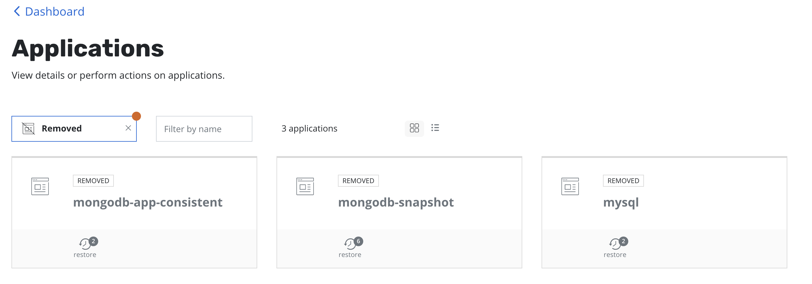

# Restoring after a cluster failure or rebuild

## Restoring Flux state

### 1. Locate cluster GPG key

```sh
export GPG_TTY=$(tty)
export FLUX_KEY_NAME="56k prod cluster (Flux) <email>"

gpg --list-secret-keys "${FLUX_KEY_NAME}"
# pub   rsa4096 2021-03-11 [SC]
#       772154FFF783DE317KLCA0EC77149AC618D75581
# uid           [ultimate] 56k prod cluster (Flux) <email>
# sub   rsa4096 2021-03-11 [E]

export FLUX_KEY_FP=772154FFF783DE317KLCA0EC77149AC618D75581
```
### 2. Verify cluster is ready for Flux

```sh
flux --kubeconfig=./kubeconfig check --pre
# ► checking prerequisites
# ✔ kubectl 1.21.0 >=1.18.0-0
# ✔ Kubernetes 1.20.5+k3s1 >=1.16.0-0
# ✔ prerequisites checks passed
```
### 3. Pre-create the `flux-system` namespace

```sh
kubectl --kubeconfig=./kubeconfig create namespace flux-system --dry-run=client -o yaml | kubectl --kubeconfig=./kubeconfig apply -f -
```
### 4. Add the Flux GPG key in-order for Flux to decrypt SOPS secrets

```sh
gpg --export-secret-keys --armor "${FLUX_KEY_FP}" |
kubectl --kubeconfig=./kubeconfig create secret generic sops-gpg \
    --namespace=flux-system \
    --from-file=sops.asc=/dev/stdin
```
### 5. Install Flux

!!! warning "Due to race conditions with the Flux CRDs you will have to run the below command twice. There should be no errors on this second run."

```sh
kubectl --kubeconfig=./kubeconfig apply --kustomize=./cluster/base/flux-system
# namespace/flux-system configured
# customresourcedefinition.apiextensions.k8s.io/alerts.notification.toolkit.fluxcd.io created
# customresourcedefinition.apiextensions.k8s.io/buckets.source.toolkit.fluxcd.io created
# customresourcedefinition.apiextensions.k8s.io/gitrepositories.source.toolkit.fluxcd.io created
# customresourcedefinition.apiextensions.k8s.io/helmcharts.source.toolkit.fluxcd.io created
# customresourcedefinition.apiextensions.k8s.io/helmreleases.helm.toolkit.fluxcd.io created
# customresourcedefinition.apiextensions.k8s.io/helmrepositories.source.toolkit.fluxcd.io created
# customresourcedefinition.apiextensions.k8s.io/kustomizations.kustomize.toolkit.fluxcd.io created
# customresourcedefinition.apiextensions.k8s.io/providers.notification.toolkit.fluxcd.io created
# customresourcedefinition.apiextensions.k8s.io/receivers.notification.toolkit.fluxcd.io created
# serviceaccount/helm-controller created
# serviceaccount/kustomize-controller created
# serviceaccount/notification-controller created
# serviceaccount/source-controller created
# clusterrole.rbac.authorization.k8s.io/crd-controller-flux-system created
# clusterrolebinding.rbac.authorization.k8s.io/cluster-reconciler-flux-system created
# clusterrolebinding.rbac.authorization.k8s.io/crd-controller-flux-system created
# service/notification-controller created
# service/source-controller created
# service/webhook-receiver created
# deployment.apps/helm-controller created
# deployment.apps/kustomize-controller created
# deployment.apps/notification-controller created
# deployment.apps/source-controller created
# unable to recognize "./cluster/base/flux-system": no matches for kind "Kustomization" in version "kustomize.toolkit.fluxcd.io/v1beta2"
# unable to recognize "./cluster/base/flux-system": no matches for kind "GitRepository" in version "source.toolkit.fluxcd.io/v1beta1"
# unable to recognize "./cluster/base/flux-system": no matches for kind "HelmRepository" in version "source.toolkit.fluxcd.io/v1beta1"
# unable to recognize "./cluster/base/flux-system": no matches for kind "HelmRepository" in version "source.toolkit.fluxcd.io/v1beta1"
# unable to recognize "./cluster/base/flux-system": no matches for kind "HelmRepository" in version "source.toolkit.fluxcd.io/v1beta1"
# unable to recognize "./cluster/base/flux-system": no matches for kind "HelmRepository" in version "source.toolkit.fluxcd.io/v1beta1"
```
:tada: at this point after reconciliation Flux state should be restored.

## Restoring PVCs using Kasten

Recovering from a K10 backup involves the following sequence of actions:

### 1. Create a Kubernetes Secret, k10-dr-secret, using the passphrase provided while enabling DR

```sh
kubectl create secret generic k10-dr-secret \
    --namespace kasten-io \
    --from-literal key=<passphrase>
```
### 2. Install a fresh K10 instance

!!! info "Ensure that Flux has correctly deployed K10 to it's namespace `kasten-io`"

### 3. Provide bucket information and credentials for the object storage location

!!! info "Ensure that Flux has correctly deployed the `minio` storage profile and that it's accessible within K10"

### 4. Restoring the K10 backup

Install the helm chart that creates the K10 restore job and wait for completion of the `k10-restore` job

```sh
helm install k10-restore kasten/k10restore --namespace=kasten-io \
    --set sourceClusterID=<source-clusterID> \
    --set profile.name=<location-profile-name>
```

### 5. Application recovery

Upon completion of the DR Restore job, go to the Applications card, select `Removed` under the `Filter by status` drop-down menu.

Click restore under the application and select a restore point to recover from.


